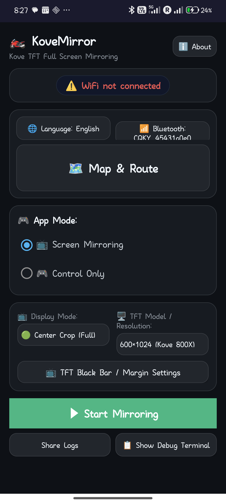
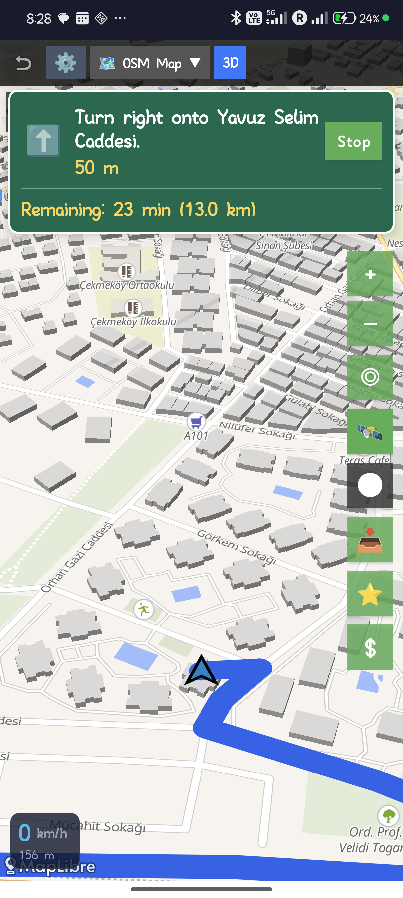

# KoveMirror

# Latest APK is in builds directory. "KoveMirrorLatest.apk", right click and then select save as to download.

# 🇹🇷 KoveMirror (Türkçe)

(Bu metin ve program AI tarafından geliştirilmiştir.)

KoveMirror, Kove 800 (800X Pro vb.) model motosikletlerin TFT ekranlarına telefonunuzun ekranını yansıtmanızı (Screen Mirroring) sağlayan açık kaynaklı bir Android uygulamasıdır. Orijinal ThinkerRide sistemine alternatif olarak geliştirilmiş olup, tamamen yerel ağ üzerinden bağımsız çalışır. 

Motosikletin navigasyon için TFT ekranında gösterdiği görüntüyü, herhangi bir üçüncü taraf uygulamaya bağımlı kalmadan Google Maps, Yandex Navigasyon, Kurviger gibi kendi istediğiniz uygulamalarla kullanabilmenizi sağlar. Ayrıca uygulama içinde motosiklet sürüşü için optimize edilmiş yerleşik **2D/3D Harita, Rota Import (GPX/KML/KMZ), Canlı Rota Hava Durumu, Sert Viraj İkazları, Adım Adım Navigasyon ve Ekran Kapalıyken Kesintisiz TFT Haritası** özellikleri bulunur.

  
  &nbsp; &nbsp; &nbsp; &nbsp;
  

---

## 🗺️ Harita, Rota ve Navigasyon Özellikleri

Uygulama içinde **"Harita & Rota"** butonu ile erişilebilen gelişmiş harita modülü şu özellikleri sunar:

1. **4 Harita Katmanı Seçeneği (2D & 3D)**:
   - **Harita (OSM)**: OpenStreetMap Mapnik standart vektör haritası.
   - **Topo**: OpenTopoMap arazi ve topografya haritası.
   - **Uydu (Sat)**: ESRI World Imagery yüksek çözünürlüklü uydu görüntüsü katmanı.
   - **🌐 3D Vektör & Arazi Haritası (MapLibre)**: 3 boyutlu bina, arazi ve sürüş perspektifi sunan modern 3D harita katmanı. Gidon tuşu veya ekrandan tek tıkla 2D/3D arasında anında geçiş.

2. **📱 Ekran Kapalıyken Kesintisiz TFT Navigasyonu (Virtual Display Presentation)**:
   - Telefon ekranı kapandığında / kilitlendiğinde bile arka planda çalışan sanal ekran mimarisi (`VirtualDisplay` & `KovePresentation`) sayesinde motosikletin TFT kadranına kesintisiz harita, canlı GPS takibi, yüklü rotalar ve adım adım navigasyon akmaya devam eder.
   - Telefonu tekrar açtığınızda telefon ile TFT harita durumları kusursuz olarak çift yönlü senkronize olur.

3. **🌤️ Canlı Rota Hava Durumu (Route Weather Forecast)**:
   - Rota güzergahı boyunca açık kaynaklı Open-Meteo entegrasyonu ile sıcaklık (°C), yağış türü, yağış ihtimali (%) ve rüzgar hızı rozetleri harita üzerinde gösterilir.
   - Rozetler 2D ve 3D haritalarda rota çizgisinin en üstünde net okunur şekilde konumlanır; dokunulduğunda detaylı hava durumu bilgisi verir.

4. **⚡ Sert Viraj & U-Dönüş Uyarı Sistemi (Sharp Curve & Hairpin Warnings)**:
   - %100 çevrimdışı geometrik analiz: İnternet gerektirmeden rota geometrisindeki açı değişimleri ve viraj yarıçapını anında analiz eder.
   - Harita üzerinde viraj başlarında renk kodlu kompakt rozetler gösterir:
     - 🔴 **Kırmızı (`⚠️`):** U-Viraj / Hairpin ($180^\circ$ dönüşler / İğne deliği)
     - 🟠 **Turuncu (`⬅️` / `➡️`):** Sert Viraj ($90^\circ$ ve üzeri keskin virajlar)
     - 🟡 **Sarı (`↖️` / `↗️`):** Orta Sertlikte Viraj

5. **KML / KMZ / GPX Rota Import & Takip**:
   - GPX, KML ve KMZ formatındaki sürüş rotalarını harita üzerine yükleme.
   - Renk ve çizgi kalınlığı ile özelleştirme, yön okları ve km mesafe taşları ekleme.
   - Birden fazla rotayı aynı anda yükleme, görünürlüklerini açıp kapama, yönünü tersine çevirme (Reverse Route) veya silme.

6. **📍 Haritada Uzun Basarak Navigasyon (OSRM Routing)**:
   - Harita üzerinde herhangi bir yere **uzun basarak (long press)** hedef pini bırakma ve **"Navigasyonu Başlat"** seçeneği.
   - Canlı **Turn Banner**: Sıradaki dönüş yönü, manevraya kalan mesafe ve toplam kalan süre/km takibi.

7. **🏎️ Canlı Hız Göstergesi ve Hız Limiti Uyarısı**:
   - Anlık GPS hızını gösteren dinamik hız göstergesi.
   - Bulunduğunuz yolun yasal hız sınırını tespit etme ve hız aşıldığında dinamik görsel ikaz.

8. **🔴 GPX Canlı Rota Kaydedici (Track Recorder)**:
   - Sürüşünüzü harita üzerinden takip ederken gerçek zamanlı olarak GPX formatında cihazınıza kaydetme.

9. **⚙️ Yenilenen Profesyonel Harita Ayarları (Map Settings)**:
   - **Canlı Önizleme Kutusu:** Seçilen temayı, imleci ve iz rengini anında simüle eden Hero Preview kartı.
   - **Segmented Butonlar:** Gündüz / Gece / Otomatik tema seçimi (`☀️ Gündüz | 🌙 Gece | 🔄 Otomatik`).
   - **Görsel İmleç Kartları:** 5 farklı konum imleci (`⬆️ Ok`, `🏍️ Motor`, `🔵 Nokta`, `🎯 Hedef`, `📍 İğne`) ve 7 renkli palet.

---

## ⚡ Sistem ve Gelişmiş Özellikler

- **🔋 Ekran Karartma / Enerji Tasarrufu Modu (Dimming):** Yansıtma açıkken telefonun aşırı ısınmasını engellemek ve pil tüketimini düşürmek amacıyla telefon ekranını karartma seçeneği.
- **🎮 Gidon Kumandası Entegrasyonu:** Motosikletin gidon tuşları ile harita yakınlaştırma (Zoom), harita kaydırma (Pan), müzik kontrolü, ses seviyesi, uygulama değiştirme ve konumuma dönme gibi çoklu mod kontrolleri (`KoveAccessibilityService`).
- **🌐 5 Dil Desteği:** 🇹🇷 Türkçe, 🇬🇧 İngilizce, 🇪🇸 İspanyolca, 🇮🇹 İtalyanca ve 🇬🇷 Yunanca arayüz desteği.
- **🛡️ Gelişmiş Kararlılık & Kaynak Yönetimi:** BLE komut kuyruğu yönetimi, Wakelock zaman aşımı korumaları, döngüsel log boyutu sınırlandırması ve optimize edilmiş TCP soket yönetimi *(Dominik Ladoš'un katkılarıyla)*.

---

## Protokol Yapısı ve İletişim

Kove TFT ekranları, telefon ile haberleşmek için Bluetooth (BLE) ve Wi-Fi (TCP) altyapısı kullanır:

### 1. Wi-Fi Ağı (Network)
Motosiklet, kendi üzerinde bir Wi-Fi Hotspot oluşturur (Genellikle `192.168.10.1` IP adresi). Telefon, bu ağa bağlandığında IP adresi alır (`192.168.10.2`). Uygulama `bindProcessToNetwork` kullanarak telefonun mobil verisi açık olsa bile KoveMirror'un sadece motosikletin ağı üzerinden iletişim kurmasını garanti eder. Bu sayede telefondaki diğer uygulamalar arka planda mobil veri üzerinden internete bağlanmaya devam edebilir (Telefonunuzun Wi-Fi ayarlarından "İnternetsiz ağlarda mobil veriyi kullan" seçeneğini açmanız önerilir).

### 2. TCP Portları
Telefon (KoveMirror uygulaması), motosikletin bağlanması için 3 farklı TCP sunucu soketi (Server Socket) açar:
- **Port 17818 (Control Port):** İki cihaz arasındaki el sıkışma (handshake), versiyon bilgisi aktarımı ve sensör / araç durumu için kullanılır.
- **Port 15456 (Video Port):** `MediaProjection` API'den alınan ve H.264 formatında encode edilen ekran videosunun TFT'ye aktarıldığı ana porttur.
- **Port 15457 (Dedicated Heartbeat Port):** Bağlantının koptuğunu anında tespit etmek için sürekli olarak (200ms aralıklarla) ping/kalp atışı gönderilen sokettir.

### 3. Bluetooth (BLE) Eşleşmesi ve Handshake
Cihazların haberleşmeye başlaması için BLE zorunludur:
- Uygulama `0000e0ff-...` Service UUID değerine bağlanır.
- `FFE1` karakteristik adresine yazma (Write) işlemi yapar, `FFE2` üzerinden bildirimleri (Notify) dinler.
- Telefondan `PAIR` komutu (msg_id: 27) gönderilir. TFT `result: 1` yanıtını verdikten sonra, uygulama yansıtmayı aktifleştiren (`msg_id: 25, msg_type: 23`) JSON paketini gönderir.

### 4. Control Handshake & Heartbeat
- BLE üzerinden yansıtma aktif edildikten sonra TFT, telefonun 17818 portuna bağlanır.
- TFT tarafından gönderilen `TUC` (Token) paketi alınır.
- Binary (Hex) formatında karşılıklı komutlar gönderilir.
- **2026 Modeller İçin Önemli:** 2026 model Kove TFT ekranları güvenlik amacıyla her 1 saniyede bir Control Portu üzerinden `02 01 00 00 00 00` şeklinde Heartbeat gönderir. Uygulamanın Video soketini açması için bu paketi "yankılayarak (echo)" TFT'ye geri göndermesi şarttır.

## Derleme Gereksinimleri (Build Instructions)

Bu projeyi derleyebilmek için:
- **Android Studio** (Güncel Sürüm önerilir)
- **JDK 17** veya üstü
- **Android SDK:** `compileSdk 34`
- **Gradle:** Sürüm `8.x` ve üstü

Projeyi Android Studio'da açıp `Build -> Make Project` diyerek ya da komut satırından `./gradlew assembleDebug` komutuyla doğrudan derleyebilirsiniz.

## Test Edilen Cihazlar
- **2024 Kove 800X Pro:** Sorunsuz çalışıyor.
- **2026 Kove Modelleri:** Gelişmiş güvenlik ve strict heartbeat protokolleriyle başarılı şekilde test edildi.

---

# 🇬🇧 KoveMirror (English)

(This text and the program itself developed by AI.)

KoveMirror is an open-source Android application that enables screen mirroring from your smartphone directly to the TFT dashboard of Kove 800 motorcycles (like the 800X Pro). Built as an alternative to the official ThinkerRide system, it operates entirely locally over the motorcycle's network.

This allows you to project any navigation or media app of your choice (such as Google Maps, Waze, Kurviger, or Spotify) onto your motorcycle’s screen without restrictions. It also includes an offline-friendly, motorcycle-optimized built-in **2D/3D Map, Route Import (GPX/KML/KMZ), Live Route Weather, Sharp Curve Warnings, Turn-by-Turn Navigation, and Screen-Off Seamless TFT Display** module.

  
  &nbsp; &nbsp; &nbsp; &nbsp;
  

---

## 🗺️ Map, Route & Navigation Features

Accessible via the **"Map & Route"** button on the main screen:

1. **4 Map Layer Options (2D & 3D)**:
   - **Maps (OSM)**: OpenStreetMap Mapnik standard vector map.
   - **Topo**: OpenTopoMap terrain and topographic contours.
   - **Satellite (Sat)**: ESRI World Imagery high-resolution satellite imagery.
   - **🌐 3D Vector & Terrain Map (MapLibre)**: Dynamic 3D building, terrain elevation, and riding perspective layer. Switch instantly between 2D and 3D via handlebar buttons or on-screen toggle.

2. **📱 Screen-Off Seamless TFT Navigation (Virtual Display Presentation)**:
   - Even when your phone screen is turned off or locked, KoveMirror runs an independent background `VirtualDisplay` and `Presentation` map, streaming live GPS positioning, imported routes, and turn-by-turn navigation directly to the motorcycle's TFT screen.
   - Seamless, real-time bi-directional synchronization when you turn your phone screen back on.

3. **🌤️ Live Route Weather Forecast**:
   - Integrates with the open-source Open-Meteo API to fetch temperature (°C), rain probability (%), precipitation amount (mm), and wind speed badges along your route.
   - Badges are layered on top in 2D and 3D maps for crisp readability with tap-for-details support.

4. **⚡ Sharp Curve & Hairpin Warnings**:
   - 100% offline geometric scan: Analyzes angular deflection and curve radius without internet connection.
   - Displays color-coded badges directly on curve apexes:
     - 🔴 **Red (`⚠️`):** Hairpin / U-Turn ($180^\circ$ sharp turns)
     - 🟠 **Orange (`⬅️` / `➡️`):** Sharp Curve ($90^\circ+$ angles)
     - 🟡 **Yellow (`↖️` / `↗️`):** Medium Curve

5. **KML / KMZ / GPX Route Import & Tracking**:
   - Import riding routes in GPX, KML, and KMZ formats.
   - Customize route lines with 10 preset colors, stroke widths, directional arrows, and kilometer distance markers.
   - Manage multiple imported routes simultaneously (visibility toggle, reverse route direction, or delete).

6. **📍 Long-Press Destination Selection & Navigation (OSRM Engine)**:
   - **Long press** anywhere on the map to drop a destination pin and tap **"Start Navigation"**.
   - **Live Top Turn Banner**: Displays upcoming turn direction arrows (left/right/uturn), distance to next maneuver, and remaining trip distance/ETA.

7. **🏎️ Real-Time Speedometer & Speed Limit Alerts**:
   - Dynamic real-time GPS speed indicator.
   - Automatic detection of road speed limits using OpenStreetMap / Overpass data and speeding alert cards.

8. **🔴 Live GPX Track Recorder**:
   - Record your real-time rides directly into standard GPX files saved on your device.

9. **⚙️ Redesigned Professional Map Settings**:
   - **Hero Live Preview:** Simulates theme, location cursor shape/color, and GPX track line in real-time.
   - **Segmented Pill Selector:** Day / Night / Auto map theme (`☀️ Day | 🌙 Night | 🔄 Auto`).
   - **Visual Cursor Chips:** 5 distinct cursor shapes (`⬆️ Arrow`, `🏍️ Moto`, `🔵 Dot`, `🎯 Target`, `📍 Pin`) with a 7-color palette.

---

## ⚡ System & Advanced Features

- **🔋 Energy-Saving Screen Dimming:** Automatically dims or turns down phone screen brightness during mirroring to conserve battery and eliminate phone overheating.
- **🎮 Handlebar Button Integration:** Multi-mode handlebar controls for Zooming, Panning, Media playback, Volume control, App switching, and Return to My Location (`KoveAccessibilityService`).
- **🌐 5 Language Support:** Full UI localization for 🇹🇷 Turkish, 🇬🇧 English, 🇪🇸 Spanish, 🇮🇹 Italian, and 🇬🇷 Greek.
- **🛡️ Enhanced Stability & Resource Management:** Robust BLE command queues, wakelock timeout protections, circular log file limits, and hardened TCP socket lifecycle management *(Special thanks to Dominik Ladoš)*.

---

## Protocol Structure and Communication

Kove TFT screens use a combination of Bluetooth (BLE) and Wi-Fi (TCP) to negotiate and stream the display:

### 1. Wi-Fi Network
The motorcycle broadcasts its own Wi-Fi Hotspot (typically with the IP `192.168.10.1`). When the phone connects, it is assigned a local IP (`192.168.10.2`). The app uses Android's `bindProcessToNetwork` API to force all application traffic through the motorcycle's Wi-Fi, allowing the phone to maintain internet connectivity over Mobile Data for other background applications (ensure your phone's "Use mobile data when Wi-Fi has no internet" setting is enabled).

### 2. TCP Ports
The phone acts as the Server, opening three distinct TCP server sockets that the motorcycle connects to:
- **Port 17818 (Control Port):** Used for initial binary handshakes, version exchange, and receiving continuous vehicle telemetry.
- **Port 15456 (Video Port):** The main high-bandwidth socket where the H.264 encoded screen video stream is sent to the TFT.
- **Port 15457 (Dedicated Heartbeat Port):** A fast-ping socket used to rapidly detect connection drops (pings sent every 200ms).

### 3. Bluetooth (BLE) Handshake
BLE negotiation is strictly required before the TFT will accept video connections:
- The app connects to the `0000e0ff-...` Service UUID.
- It writes to the `FFE1` characteristic and subscribes to notifications on `FFE2`.
- A `PAIR` command (msg_id: 27) is sent. Once the TFT responds with `result: 1`, the app triggers the mirror activation command (`msg_id: 25, msg_type: 23`).

### 4. Control Handshake & Heartbeat
- Following BLE activation, the TFT connects to the phone's 17818 Control port.
- The TFT sends a `TUC` (Token) packet.
- Binary (Hex) handshakes are exchanged.
- **Critical for 2026 Models:** For newer Kove models (2026+), the TFT implements a stricter security protocol by continuously sending a 6-byte heartbeat (`02 01 00 00 00 00`) over the Control Port every second. The app must echo this exact heartbeat back immediately; otherwise, the TFT will refuse to open the Video Port.

## Build Instructions

To compile this project, you will need:
- **Android Studio** (Latest stable version recommended)
- **JDK 17** or higher
- **Android SDK:** `compileSdk 34`
- **Gradle:** Version `8.x` or higher

Open the project in Android Studio and select `Build -> Make Project`, or build directly from the terminal using `./gradlew assembleDebug`.

## Tested Devices
- **2024 Kove 800X Pro:** Fully compatible.
- **2026 Kove Models:** Fully compatible (incorporates strict heartbeat echoing and synchronized BLE pair timing).
